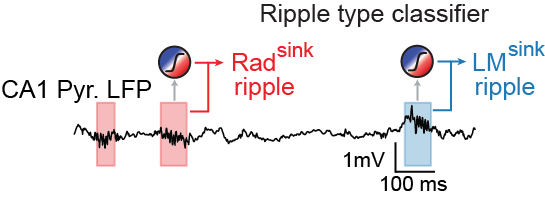
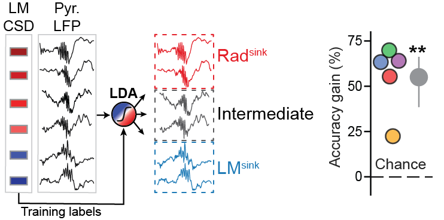

[](https://doi.org/xxx)


# Ripple LFP Classifier
The code in this directory demonstrates how to infer the CSD laminar profile of individual hippocampal ripples from the local field potential (LFP) signal recorded along the somato-dendritic axis of CA1. This work is highlighted in our article (Castelli et al. 2025).

<p align="center">
    
</p>


This [notebook](notebooks/predicting_ripple_types_from_LFP_waveform.ipynb) illustrates how to use `rippleClassifier` to preprocess the LFP signal and classify ripples into distinct types during an exemplar session.


A colab notebook version is also available [here](link).

The data was acquired using a 64-channel silicon probe spanning the CA1 somato-dendritic axis. LFP signals were sampled at 1250 Hz. Due to storage constraints, only ripple-aligned data from CA1 channels from one mouse sleep/rest session are provided. The data is stored in the `/data/` directory.


Please note that the data shared here is copyrighted to the University of Oxford.

## Model Information
In order to differentiate ripple types using only the LFP traces, we trained a linear discriminant analysis (LDA) model to classify individual ripple events using their pyramidal LFP waveforms as input features. The ripple classes (Rad$^{sink}$, Intermediate, and LM$^{sink}$) are defined using the corresponding lacunosum moleculare (LM) CSD. Prior to prediction, the model performs preprocessing [i.e. z-scoring, low-pass filtering]. Dimensionality reduction is applied [e.g. PCA], and the resulting features are fed into the classifier. To evaluate generalizability, the model was trained on data from a set of mice and tested on a held-out mouse in a leave-one-mouse-out cross-validation approach.

<p align="center">
    
</p>


## Citing This Work
If you use this software in your research, please cite our work using the provided DOI:

[](https://doi.org/xxx)


## Getting Started
To ensure a consistent development environment, we recommend creating a Conda virtual environment using the following instructions.


### Prerequisites
- [Anaconda](https://www.anaconda.com/products/distribution) or [Miniconda](https://docs.conda.io/en/latest/miniconda.html) should be installed on your system.


### Creating the 'ripple_env' Virtual Environment
1. Open a terminal or command prompt.
2. Navigate to the repository's root directory.
3. Create a new Conda virtual environment called "ripple_env" using the following command:
``` shell
conda create --name ripple_env python=3.10 numpy pandas scipy scikit-learn matplotlib seaborn jupyter
 